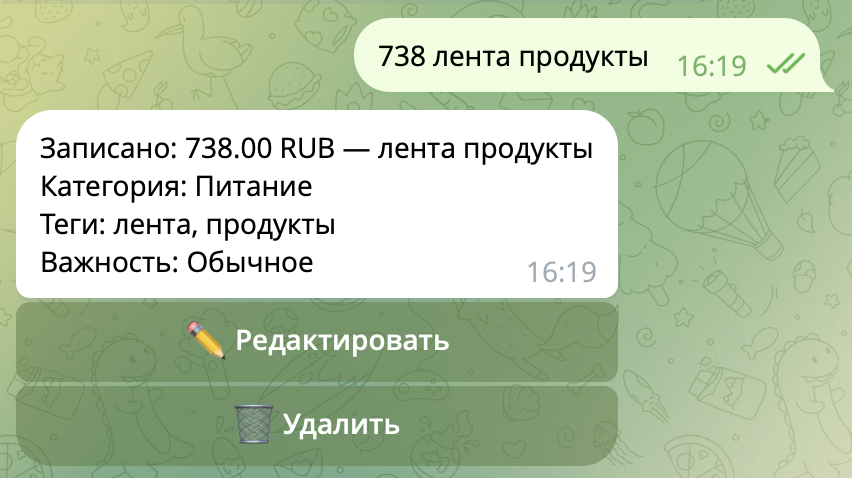
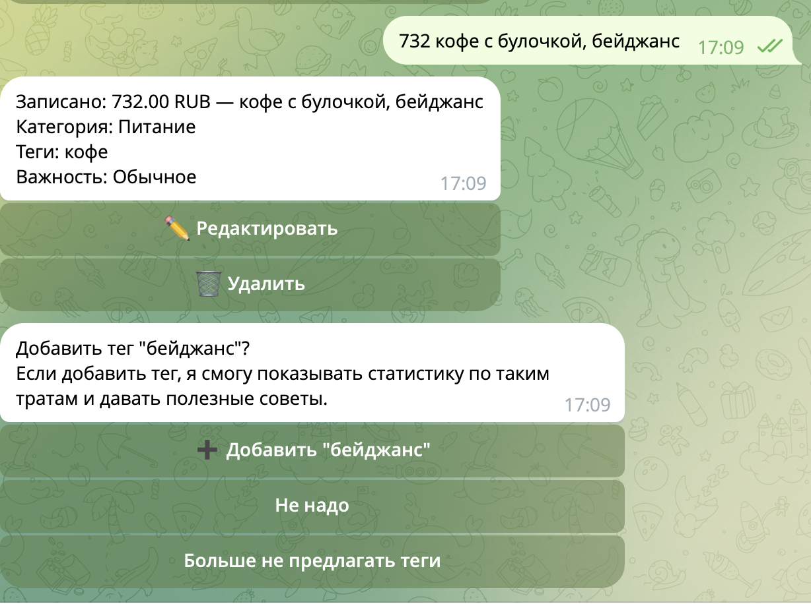
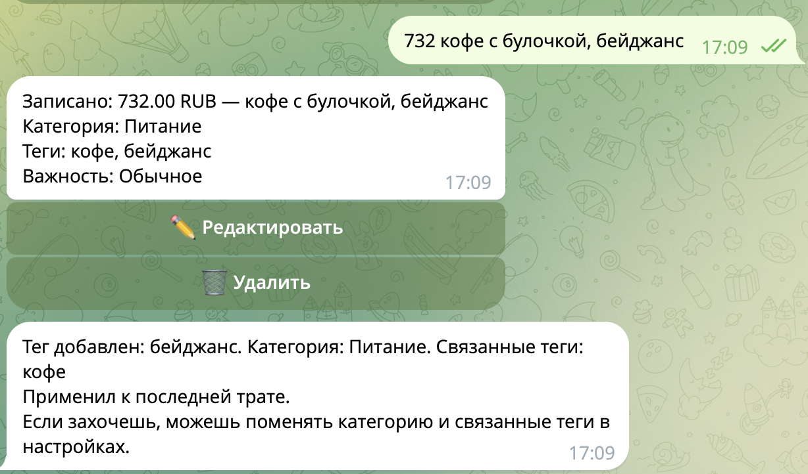
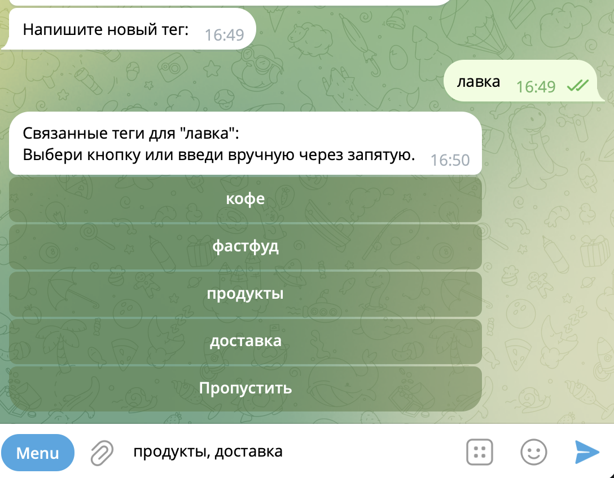
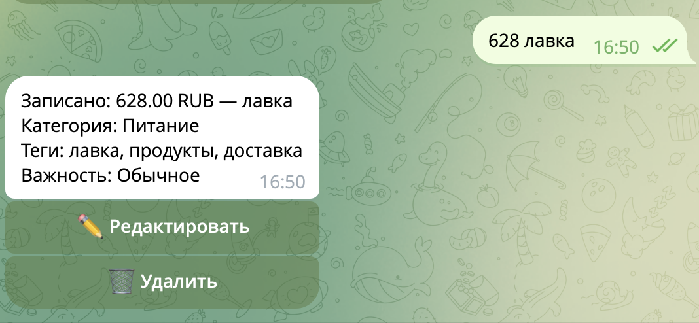
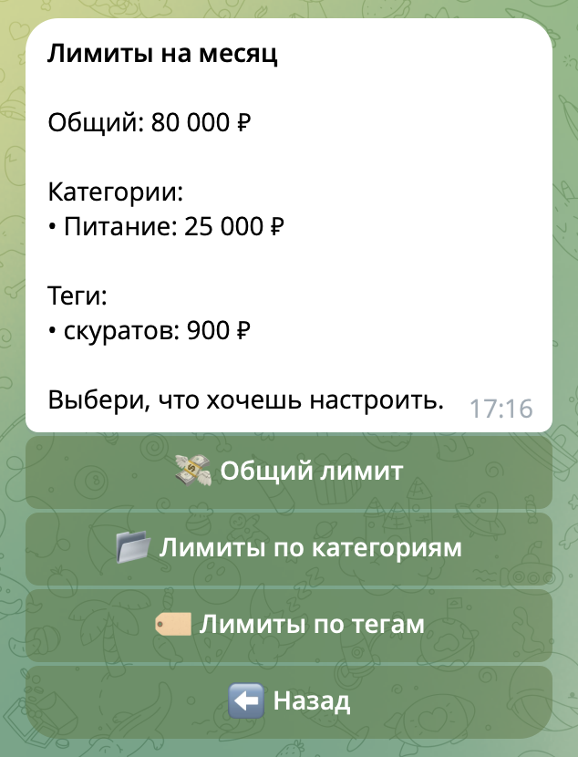

# Как пользоваться Деньгописцем с пользой

Чтобы бот был полезным, достаточно трёх вещей:

1. Регулярно записывать траты
2. Добавлять важные теги для частых расходов
3. Смотреть сводки и детальный разбор

Не нужно настраивать всё сразу. Начни с записей, а остальное можно добавить постепенно.

<h2 id="quick-start">С чего начать</h2>

1. Пиши траты коротко: `450 кофе Старс`, `1617 продукты Лента`, `890 такси`, `500 бургер Мак`
2. Подтверждай полезные теги, если бот их предлагает
3. Поставь один лимит на месяц
4. Смотри сводки
5. Раз в месяц открывай детальный разбор
6. Если хочешь работать с тратами самостоятельно, скачивай Excel-отчет

Этого уже достаточно, чтобы начать видеть, куда уходят деньги.

<h2 id="recording">Как лучше записывать траты</h2>

Лучше всего бот понимает короткие и естественные записи:

- `450 кофе`
- `1617 лента`
- `320 скуратов`
- `890 макдак`

Уточнять валюту не нужно: она уже записана в профиле.

Бот понимает известные бренды и обычные разговорные названия вроде `макдак`, `кфс`, `зара`.

Главный принцип: чем проще запись, тем легче пользоваться ботом каждый день.

<h2 id="tags">Теги: зачем они нужны</h2>

Теги помогают понять, на что именно уходят деньги.

Например, категория **Питание** слишком общая. Теги **кофе**, **фастфуд** и **продукты** уже показывают привычки. А теги конкретных мест, например **Скуратов**, **Макдак** или **Лента**, делают анализ ещё точнее.

Именно теги помогают:

- находить повторяющиеся траты
- замечать паттерны
- делать более полезный разбор с рекомендациями, где можно сократить расходы

<h2 id="when-to-save-tag">Когда стоит сохранить тег</h2>

Сохраняй тег, если это:

- частая трата
- конкретное место, где ты регулярно покупаешь
- привычка, за которой хочешь следить

Особенно полезно добавлять локальные магазины, кофейни и места, которые бот может не знать сам.

Если трата разовая, тег обычно не нужен.

<h2 id="tag-autodetect">Теги - что бот умеет сам</h2>

Бот сам умеет:

- определять общие теги
- определять известные бренды
- предлагать тег, если видит повторяющуюся трату

Но для большей точности полезно добавить свои важные теги в настройках. Либо отредактировать их связанные теги и категории.

<h2 id="linked-tags">Что такое связанные теги</h2>

Связанный тег помогает боту лучше понимать тип расходов. Он будет автоматом ставить связанные теги, если уже проставил основной тег.

Примеры:

- **Скуратов** -> **кофе**
- **Макдак** -> **фастфуд**
- **Лента** -> **продукты**
- **DDX** -> **спорт**

Проще всего думать так: связанный тег — это тип траты, который обычно бывает в этом месте.

<h2 id="limits">Как пользоваться лимитами</h2>

Лимиты нужны для контроля, а не для давления. С ними бот сможет предупреждать, какая часть лимита потрачена и стоит ли притормозить расходы.

В боте можно поставить лимит:

- на весь месяц
- на категорию
- на тег

Лучший старт:

- один лимит на месяц
- 1-2 лимита на самые важные повторяющиеся траты

Например:

- месяц: `80 000 ₽`
- кофе: `6 000 ₽`
- такси: `5 000 ₽`

Не ставь сразу много мелких лимитов. Это утомляет и редко помогает.

<h2 id="analysis">Детальный разбор трат</h2>
**В доработке**

Детальный разбор помогает быстро увидеть:

- куда ушло больше всего денег
- какие траты повторяются слишком часто
- где есть возможность для экономии
- план по улучшению финансов

Разбор особенно полезен, когда:

- ты регулярно записываешь траты
- у повторяющихся расходов есть теги
- не всё свалено в категорию `Другое`

Разбор можно делать только за прошедшие месяцы.

<!-- Пример скрина:

-->

<h2 id="digests">Что дают сводки</h2>

**Сводки** помогают быстро понять:

- сколько уже потрачено
- какие категории и теги сейчас самые заметные
- есть ли риск выйти за лимиты

**Excel-отчёт** нужен, если хочется выгрузить траты в таблицу и работать с ними самостоятельно.

<h2 id="mistakes">Что чаще всего мешает получить пользу</h2>

- записывать траты не сразу, а вспоминать потом
- не использовать теги вообще
- создавать слишком много случайных тегов
- ждать глубокого разбора, когда трат пока мало
- ставить слишком много лимитов сразу
